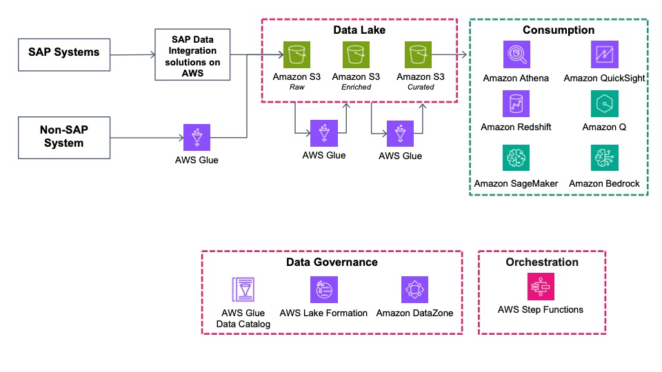
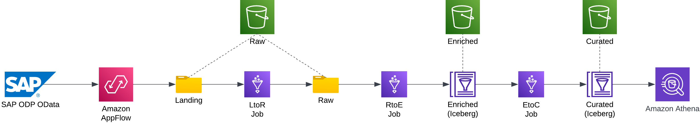
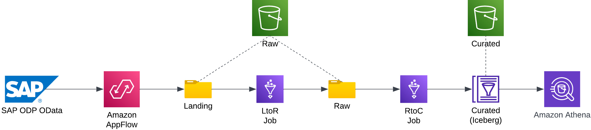
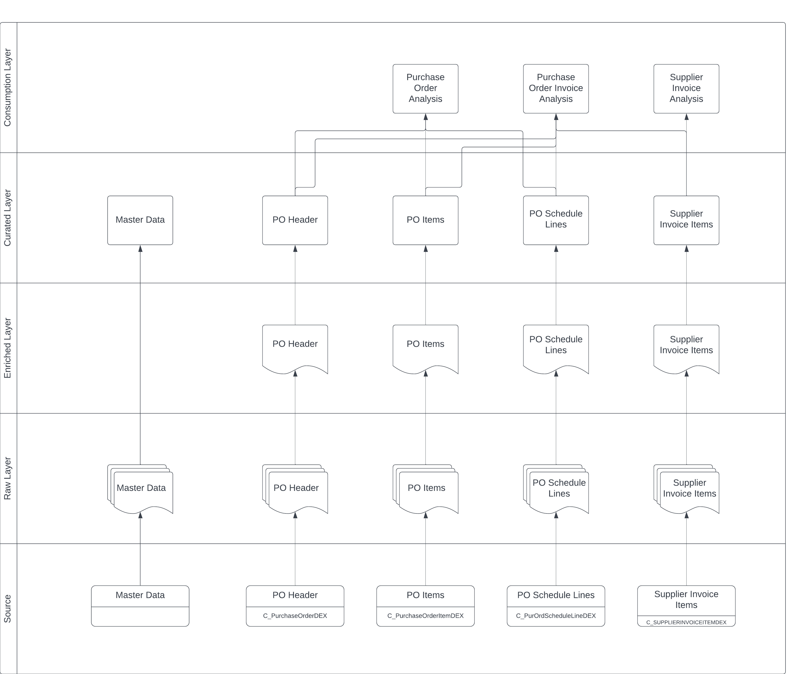

# Guidance for Data Lake with SAP and non-SAP data on AWS

This Guidance demonstrates how to combine and consolidate SAP and non-SAP data from disparate sources using AWS Datalakes and Machine Learning services allowing customers to unlock hidden business insights.

## Table of Contents

1. [Objective](#objective)
2. [SAP Data Lake Architecture](#sap-data-lake-architecture)
3. [Sample Code - Procure to Pay](#sample-code-procure-to-pay)

## Objective 

The objective of the Guidance for Data Lake with SAP and non-SAP data on AWS is to provide a prescriptive guidance, a set of building blocks and working examples that can be leveraged to deploy Data Lakes in AWS for SAP Analytics. The key components of this solution guidance are 

* AWS Reference Architecture for SAP Data Lake
    - Date Ingestion
    - Data Lake
    - Data Management
    - Consumption
* Pre-built sample code that deploys data models to cover functional use cases 
    - Procure to Pay
    - Order to Cash
    - Record to Report
    - Others
* AWS Governance Framework for SAP Data
    - Data Governance & Security
    - Data Catalog
        - Technical
        - Business
    - Orchestration
    - Observability

## SAP Data Lake Architecture 

### Data Pipeline Overview - Transactional Data

### Data Pipeline Overview - Master Data

### Source

The SAP source systems can be any ABAP based systems such as S/4HANA or ECC. SAP Systems can be RISE, AWS native or on-premise since the communication to the Data Lake can be securely routed through [AWS PrivateLink](https://aws.amazon.com/privatelink/) (in case of RISE and AWS native) or [AWS VPN](https://aws.amazon.com/vpn/) / [AWS Direct Connect](https://aws.amazon.com/directconnect/) (in case of on-premise)

The preferred method would be to use ODP-based data extraction via [OData](https://help.sap.com/doc/saphelp_nw75/7.5.5/en-US/11/853413cf124dde91925284133c007d/frameset.htm) as it can perform consistent delta extractions of the source objects. The source objects that can be extracted are CDS Views, BW Extractors and Tables (via SLT) as long as they are exposed as an OData Service.

Non-SAP systems can also be used as Data sources and integrated in the same process, so as to combine their data with SAP Data in the same Data Lake.

### Data Ingestion

The Data Ingestion / Data Extraction for SAP Data Sources can be done via:
1/ AWS Native services such as Amazon AppFlow (https://docs.aws.amazon.com/appflow/latest/userguide/sapodata.html) or AWS Glue (https://aws.amazon.com/glue/)

2/ SAP’s Data Warehouse SaaS Solution [SAP Datasphere](https://www.sap.com/products/technology-platform/datasphere.html) 
3/ ISV or 3rd party solutions such as [SNP Glue](https://www.snpgroup.com/en/platform/software-and-components/snp-glue/) , [Bryteflow](https://bryteflow.com/) , [Qlik](https://www.qlik.com/us), [Palantir HyperAuto](https://www.palantir.com/offerings/hyperauto/) or [Boomi](https://boomi.com/) 
 
For more information, please refer to the following [Solution Guidance](https://aws.amazon.com/solutions/guidance/data-integration-management-to-from-sap-on-aws/)

For non-SAP data sources, [AWS Glue](https://aws.amazon.com/glue/) can also be used to achieve this.

### Data Lake

#### Raw Layer

The Raw Layer is built on [Amazon S3](https://aws.amazon.com/s3/ ) and is the initial layer where the data extracted from the source system lands. The data present here has not been transformed and is in it’s original file format.( for example, JSON or CSV)

For data extracted from an SAP system this includes all records that have been generated by the delta source object or all records for full extracts. The data in this layer is used to determine changes and consolidate in the next layer since it will contain multiple versions of the same data (changes, full loads, etc).

Each extractor is represented as a table within this layer and queried as required for data loads, audit or any type of raw data analysis.

Data extracted from SAP (via SAP ODP OData or other mechanisms) needs to be prepared for further processing. The extracted data will be packaged in several files (defined by the package / page size in the extraction tool) hence multiple files for a given extraction run can be generated. Given the data is extracted from the ODP Queues (ODQ), there could be multiple records for the same document extracted, and these can be stored in multiple different files. In order to ensure data is processed in the right order, and to enable parallel processing from the Raw Layer to the Enriched Layer, each record needs to be enriched with a timestamp (time of extraction) and record number (order within the file). 
In the Code Sample provided, this is achieved by the -ltor Glue jobs. Files extracted with AppFlow lands on a Landing folder within the Raw Bucket. The -ltor jobs insert the file creation timestamp (from the file name) and a record number (sequential counter based for each line) as two fields in each record and data is stored in a Raw folder within the Raw Bucket. 

#### Enriched Layer

The Enriched Layer is built on [Amazon S3](https://aws.amazon.com/s3/) and it contains a true representation of the data in the source SAP system, with logical deletions (identified by ODQ_CHANGEMODE). Data is stored in files in [Iceberg format](https://aws.amazon.com/what-is/apache-iceberg/). The Iceberg Table file format allows the creation of [Glue / Athena Tables](https://docs.aws.amazon.com/athena/latest/ug/understanding-tables-databases-and-the-data-catalog.html) within the [Glue Data Catalog](https://docs.aws.amazon.com/glue/latest/dg/catalog-and-crawler.html), supporting Database type operations such as Insert, Update and Deletion, with the Iceberg file format handling the file operations (deletion of records, etc). Iceberg tables also supports the concept of [Time Travel](https://docs.aws.amazon.com/athena/latest/ug/querying-iceberg-time-travel-and-version-travel-queries.html), which enables querying data for a specific point in time (feature similar to a DB table snapshot). 

Data from the Raw Layer is inserted or updated in the Enriched layer (using the -rtoe AWS Glue jobs) based on the table key and is persisted in its original format (no transformation or changes). 

For master data objects, in the sample code the Enriched layer is not utilised. Data from the Raw Layer is directly updated in the Curated Layer (using the -rtoc AWS Glue jobs).  See more details on the Data Management section. 

#### Curated Layer

The Curated Layer is the layer where data is stored for data consumption. Records deleted on the source are deleted physically. Any calculations (averages, time between dates, etc) or data manipulation (format changes, lookup from another table) can be stored in this layer, ready to be consumed. Data is updated in this layer using the -etoc and -rtoc AWS Glue jobs. Athena views are created on top of these tables for consumption from Quicksight or any other tools. 

##Data Management

Data management takes care of the data propagation between the different data lake layers. [AWS Glue](https://aws.amazon.com/glue/) is the service that provides this functionality in this solution guidance and sample code. 
The Glue Jobs provided are as follows. 

-ltor (Landing to Raw) jobs: Reads files from the Raw Bucket Landing folder and adds File Timestamp and Record Counter to each line, to enable subsequent processing of the records in the right order. These jobs leverage the Job Bookmark functionality to ensure files are processed only once. 

-rtoe (Raw to Enriched) jobs: Reads the data from the Raw Bucket Raw folder and updates into the enriched layer (upsert). Data is inserted using SQL commands using Apache Iceberg tables, which ultimately store the data in Amazon S3. These jobs take care of the upserts, deduplicating extracted data and updating records that already exist and inserting new records. 

-etoc (Enriched to Consumption) jobs: Reads data from the enriched layer and updates into the consumption layer. Transformations, calculations and filtering can be performed in these jobs. Deleted records are also physically deleted from the target. 

-rtoc (Raw to Enriched) jobs: Reads data from the Raw folder and updates in the consumption layer (similar to -etoc jobs). These jobs are used for master data objects, where the enriched layer is not necessary. 

### Data Consumption

Within the context of this Guidance, Data Consumption refers to the capability to consume data from the Data Lake, covering three concepts: Data Mart, Data Warehouse and Reporting & Analysis. 

#### Data Mart

A Data Mart is a layer that enables data consumption directly from the Data Lake files, enabling flexible and scalable creation of data models for specific use cases and analysis. 
AWS Athena (https://aws.amazon.com/athena/) is a serverless query service that enables the analysis of data stored in Amazon S3 using standard SQL. Since Athena is designed to query data directly from S3, views and partitions can be created in Athena that mimic the structure of a data mart, providing a way to organize and access data in a way similar to a data mart.

Tables are defined (https://docs.aws.amazon.com/athena/latest/ug/creating-tables.html) in Athena that are mapped to the data stored in the curated Amazon S3 Bucket. Furthermore partitioning divides the data based on commonly used filter conditions ( e.g date, product category, etc) to restrict the amount of data scanned by each query in order to increase performance and reduce costs (https://docs.aws.amazon.com/athena/latest/ug/partitions.html).

Afterwards, logical Views are created (https://docs.aws.amazon.com/athena/latest/ug/views.html) in order to join and transform data from multiple tables or partitions. These views can represent the different subject areas or dimensions of the Data Mart. 

#### Data Warehouse

Data from the Data Lake can also used to feed a Data Warehouse (with Amazon Redshift), following the Guidance for Data Warehousing Complementing SAP Solutions on AWS principles (https://aws.amazon.com/solutions/guidance/data-warehousing-complementing-sap-solutions-on-aws/). 

#### Reporting & Analysis

[Amazon QuickSight](https://aws.amazon.com/quicksight/?amazon-quicksight-whats-new.sort-by=item.additionalFields.postDateTime&amazon-quicksight-whats-new.sort-order=desc) can consume data from AWS Athena and allows the creation of visualizations, dashboards, and reports based on the data queried through Athena.

First an new dataset is created in [Amazon QuickSight](https://docs.aws.amazon.com/quicksight/latest/user/working-with-data.html) by choosing Athena as a Data Source and the previously created Views/Tables as the data that we can visualize.

Afterwards QuickSight Analysis editor can be used to create new [visualizations and dashboards.](https://docs.aws.amazon.com/quicksight/latest/user/working-with-visuals.html)

Amazon Q in QuickSight can leverage a suite of GenAI capabilities on top of the data sets, such as:

1/ Answering business questions through [natural language processing](https://docs.aws.amazon.com/quicksight/latest/user/working-with-quicksight-q.html)

2/ [Authoring Experience](https://docs.aws.amazon.com/quicksight/latest/user/generative-bi-author-experience.html) - build visualizations and dashboards through natural language processing 

3/ [Executive Summaries](https://docs.aws.amazon.com/quicksight/latest/user/gen-bi-executive-summaries.html) - create a summary of all the insights found in the data as well as complete data stories

All information regarding the AI/ML capabilities of Amazon QuickSight can be found [here](https://docs.aws.amazon.com/quicksight/latest/user/making-data-driven-decisions-with-ml-in-quicksight.html)

### Data Catalogue - Technical

The Glue Data Catalog enables the representation of the Data Lake files in table and views, similar to what a Database provides. 
The code provided in this guidance provides two databases to represent the Enriched and Curated Layer. 
The Enriched Layer tables are created based on the structure of the SAP ODP OData services that are consumed from SAP. The creation of these tables is automated by a [Lambda Function](https://github.com/aws-solutions-library-samples/guidance-for-datalake-with-sap-and-non-sap-data-on-aws?tab=readme-ov-file#3-upload-and-run-the-lambda-function-to-create-the-enriched-and-curated-tables). This Lambda function reads the OData services from a configuration (.json) file and calls the service to get the metadata, subsequently mapping the SAP data types to Glue data types and creates the tables in the Glue Catalog database. 
For the Master Data objects, since there is not Enriched layer, the same approach is utilised for the Curated Table. 
For the Transactional Data objects, the Curated Layer Tables and Views are provided on a [DDL format](https://github.com/aws-solutions-library-samples/guidance-for-datalake-with-sap-and-non-sap-data-on-aws?tab=readme-ov-file#4-run-ddl-script-to-create-curated-tables-and-athena-views). 

## Sample Code Functional Scope - Procure to Pay

The Sample Code provides data pipelines and data models covering the Procure to Pay process. The diagram below illustrates the data flows included, covering Purchase Order Header, Purchase Order Items, Purchase Order Schedule Lines, Supplier Invoice Line Items and Master Data (see git repository for the detailed list of objects). 

