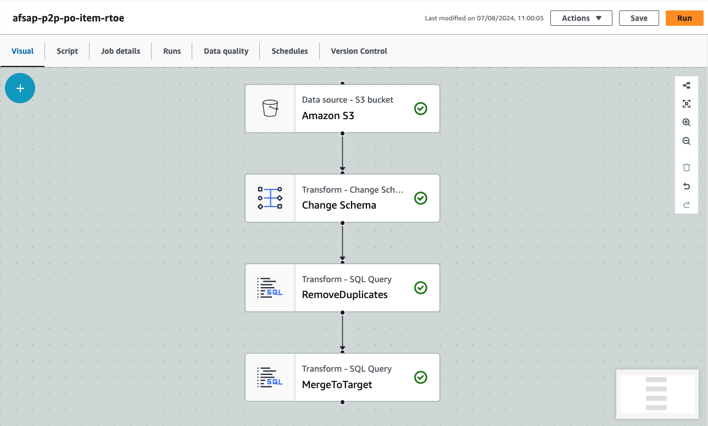

# Guidance for Data Lake with SAP and non-SAP data on AWS

This Guidance demonstrates how to combine and consolidate SAP and non-SAP data from disparate sources using AWS Datalakes and Machine Learning services allowing customers to unlock hidden business insights.

You can find details about the architecture in the [Architecture Overview page](ArchitectureOverview.md)


## Table of Contents


1. [Overview](#overview)
2. [Prerequisites](#prerequisites)
3. [Deployment Steps](#deployment-steps)
4. [Deployment Validation](#deployment-validation-required)
5. [Run the Glue Jobs to Load Data](#run-the-glue-jobs-to-load-data)
6. [Run Athena Queries to View Data](#run-athena-queries-to-view-data)
7. [Next Steps](#next-steps)
8. [Cleanup](#cleanup)
8. [FAQ, known issues, additional considerations, and limitations](#faq-known-issues-additional-considerations-and-limitations)
10. [Revisions](#revisions)
11. [Notices](#notices)
12. [Authors](#authors)

## Overview 

### Solution Overview
1. **Data Ingestion**: The solution leverages AWS AppFlow to extract SAP data in near real-time using OData ODP, BW Extractors, CDS views, and SLT table replication. This provides a flexible and scalable data ingestion mechanism.
2. **Data Lake Architecture**: The data lake is structured into three layers:
    - Raw Layer: The raw data is stored in Amazon S3 in its original format, serving as the single source of truth.
    - Enriched Layer: The data is transformed and enriched, leveraging the Iceberg Open Table Format for advanced data functionality such as time travel and upsert operations.
    - Curated Layer: The data is further processed and refined, ready for consumption by data marts and analytical tools.
3. **Data Processing**: AWS Glue is used to process the data, handling tasks like data ingestion, transformation, and reconciliation. Glue jobs identify new, changed, and deleted records, and handle any data quality issues.
4. **Data Consumption**: The curated data is made available through Amazon Athena views or loaded into Amazon Redshift for a data warehouse architecture. Various AWS services, such as Amazon QuickSight, Amazon SageMaker, and Amazon Bedrock, can be used to consume and analyze the data.
5. **Data Cataloging and Governance**: The data is cataloged in the AWS Glue Data Catalog, and an Amazon Data Zone provides a business-level catalog. Fine-grained access control can be implemented using AWS Lake Formation.
6. **Orchestration and Monitoring**: Data pipelines are centrally orchestrated and monitored using AWS Step Functions.


### Cost
_You are responsible for the cost of the AWS services used while running this Guidance. As of September 2024, the cost for running this Guidance with the default settings in the US East (N. Virginia)) is approximately $600 per month (Assumption: 1tb storage, delta flows run every 5 minutes, full data flows run daily. Each flow transfers 2mb of data each time. 100 Athena queries are executed per day)._

_We recommend creating a [Budget](https://docs.aws.amazon.com/cost-management/latest/userguide/budgets-managing-costs.html) through [AWS Cost Explorer](https://aws.amazon.com/aws-cost-management/aws-cost-explorer/) to help manage costs. Prices are subject to change. For full details, refer to the pricing webpage for each AWS service used in this Guidance._

#### Cost Table

The following table provides a sample cost breakdown for deploying this Guidance with the default parameters in the US East (N. Virginia) Region for one month.

| AWS service  | Dimensions | Cost [USD] |
| ----------- | ------------ | ------------ |
| Amazon AppFlow | Price per flow run | $0.001 month |
| Amazon AppFlow | Data processing price for flows whose destinations are integrated with AWS PrivateLink  | $0.02 per GB month |
| AWS Glue Interactive Sessions | Duration for provisioned interactive sessions | $0.04 per minute per 5 Data Processing Units, per month |
| AWS Glue Data Catalog | Storage free for the first million objects stored | $1.00 per 100,000 objects stored above 1M, per month |
| Amazon Simple Storage Service | GB per month |  $0,023 per GB/month |
| Amazon Simple Storage Service | Put requests per month |  $0,000005 per GB/month |
| Amazon Simple Storage Service | Get requests per month |  $0,0000004 per GB/month |
| Amazon Athena  | Queries per month x GB  |  $5 per TB per Query / month |


## Prerequisites 

### 1. Create the OData Services in SAP that will be used as data providers through ODP.

The Data Lake Solution Guidance Sample utilises SAP Standard Delta Enabled CDS views. These views need to be exposed as OData services in transaction SEGW. You can follow this [blog](https://community.sap.com/t5/technology-blogs-by-members/exposing-sap-bw-extractors-via-odp-as-an-odata-service/ba-p/13473362), from step 3 onwards, selecting ABAP Core Data Services instead of DataSources/Extractors (see screenshot below). 


#### 2. The CDS Views required are: 

|Short Description|CDS View Name|ODP Name|
|-----------------|-------------|--------|
|Purchase Order Header|C_PurchaseOrderDEX|CMMPURORDDEX$F|
|Purchase Order Items|C_PurchaseOrderItemDEX|CMMPOITMDX$F|
|Purchase Order Schedule Lines|C_PurOrdScheduleLineDEX|CMMPURORDSLDEX$F|
|Supplier Invoices|C_SUPPLIERINVOICEITEMDEX|CMMSUPINVCITMDEX$F|
|Purchasing Organization|C_PURCHASINGORGANIZATIONDEX|CMMPURORGDX$P|
|Address|I_ADDRESS_2|IADDRESS2$P|
|Company Code|I_COMPANYCODE|IFICOMPANYCODE$P|
|Country Attributes|I_COUNTRY|IFICOUNTRY$P|
|Country Texts|I_COUNTRYTEXT|IFICOUNTRYTEXT$T|
|Currency Attributes|I_CURRENCY|IFICURRENCY$P|
|Currency Texts|I_CURRENCYTEXT|IFICURRENCYTEXT$T|
|Supplier|I_SUPPLIER|I_SUPPLIER_CDS$P|
|Material Attributes|I_PRODUCT|IPRODUCT$P|
|Material Texts|I_PRODUCTDESCRIPTION|IPRDDESCR$P|
|Plant|I_PLANT|IPLANT$P|
|Material Group|I_PRODUCTGROUPTEXT_2|IPRODGRPTXT2$T|
|Customer|I_CUSTOMER|I_CUSTOMER_CDS$P|
|Incoterms Classification|I_INCOTERMSCLASSIFICATIONTEXT|ISDINCOTERMCLSST$T|
|Incoterms Version|I_INCOTERMSVERSIONTEXT|IINCOTERMSVT$T|
|Payment Terms|I_PAYMENTTERMSTEXT|IFIPAYMENTTERMST$T|
|Purchasing Document Category|I_PURGDOCUMENTCATEGORYTEXT|IMMPURDOCCATT$T|
|Purchasing Document Origin|I_PURCHASINGDOCUMENTORIGINTEXT|IMMPURGDOCORGTXT$T|
|Purchase Order Type|I_PURCHASINGDOCUMENTTYPETEXT|IMMPURGDOCTYPTXT$T|
|Purchasing Group|I_PURCHASINGGROUP|IMMPURCHGROUP$P|
|Control indicator for purchasing document type|I_PURGDOCUMENTSUBTYPETEXT|IMMPURDOCSUBTXT$T|
|Purchasing Document Processing State|I_PURGPROCESSINGSTATUSTEXT|IMMPURGPROCSTATT$T|
|Storage Location|I_STORAGELOCATION|ISTORAGELOCATION$P|
|Unit of Measure|I_UNITOFMEASURE|IUNITOFMEASURE$P|
|Unit of Measure Text|I_UNITOFMEASURETEXT|IUNITOFMEASTEXT$T|
|Invoice document status|I_SUPPLIERINVCSTATUSTXTAPI01|ISUPLRINVSTSTAPI$T|


### 3. Create the SAP Connection in Amazon AppFlow

Next we need to define the SAP system in Amazon AppFlow as a “Connection”

1. Go to Amazon AppFlow Service in the AWS console and go to Connections:


2. Click on the drop-down to choose a Connector type, search for SAP and choose SAP OData.


Afterwards click on Create Connection


3. In the following screen, the connection parameters need to be defined:

 

**Connection name** is the name of the connection, we can use anything. For example sap-<sid>-system 

**Select authentication method** selects between Basic Auth or OAUTH2. We select Basic Auth for username/password

**Bypass SAP single sign-on (SSO)** needs to be “Yes” if the system has SSO login enabled and we want to connect with a technical user.

**User name** and **Passwor**d are the fields that define the username and password of the technical user that has the required authorizations to read from the OData Services that we previously defined.

**Application host URL** is the FQDN HTTPS URL of the SAP System. This URL needs to be publicly available, otherwise we need to use PrivateLink that requires additional configuration. Example: https://sap-<sid>-workshop.awsforsap.sap.aws.dev

**Application service path** is the path to the  OData Catalog Service which is usually: /sap/opu/odata/iwfnd/catalogservice;v=2

**Port number** is the HTTPS port of the SAP System, for example 443

**Client number** is the productive client number of the SAP system, for example 100

**Logon language** is the logon language of the SAP system, for example en (english)

**PrivateLink** can be left Disabled if there is a public accessible HTTPS URL for the SAP System.

If this is not the case, you need to enable it and also follow the instructions in the following blog for some extra configurations:
https://aws.amazon.com/blogs/awsforsap/share-sap-odata-services-securely-through-aws-privatelink-and-the-amazon-appflow-sap-connector/

**Data encryption** can be left on default as the encryption is already done by an AWS managed key

An example configuration with publicly accessible HTTPS URL can look like this (replace \<sid\> with your SID and the Application host URL with your own)


Clicking on Connect creates the Connection.

## Deployment Steps


### 1. Run the Cloud Formation template to automatically provision the S3 buckets and Glue Databases that will be part of the Data Lake.

Next we need to create the S3 buckets that will be part of the data lake using CloudFormation.
The buckets that will be automatically created are the following:

```
afsaplakeraw-<accountID>
afsaplakeenriched-<accountID>
afsaplakecurated-<accountID>
afsaplake-deployscript-<accountID>
```

\<accountID\> will be automatically replaced with the AWS account ID in which you are running this template.
These S3 Bucket names can be changed to anything you want by editing the template.

1. Download the S3 Bucket Cloud Formation template “SolutionGuidanceDataLakeS3GlueDB.yaml” from [Git](/deployment/S3%20Buckets%20&%20Glue%20DB/SolutionGuidanceDataLakeS3GlueDB.yaml)

2. Go to the CloudFormation Service in the AWS Console


3. Click on “Create Stack” —> “With new resources (standard)”


4. Do the following selection:
Choose an existing template —> Upload a template file→ Choose file → Choose the YAML file that has been downloaded in step 1/ → Click Next


5. In the next screen, some parameters need to be filled out


**Stack name** is the name of the Cloudformation stack you are creating, you can use anything

**GlueDatabaseForCurated** and **GlueDatabaseForEnriched** should be left default.

Click Next

6. In the next screen we can leave everything on default and click next


7. In the next screen we can review or stack and then click Submit

8. After that, we can go back to the main screen of the Cloud Formation Service and go to Stacks to find our deployment


By clicking on it we can see details about it:


### 2. Run the Cloud Formation template to automatically provision the AppFlows that will extract data from the SAP system.

1. Download the AppFlow Cloud Formation template “SolutionGuidanceDataLakeAppFlows.yaml” from [Git](/deployment/Appflow/SolutionGuidanceDataLakeAppFlows.yaml)

2. Go to the CloudFormation Service in the AWS Console


3. Click on “Create Stack” —> “With new resources (standard)”


4. Do the following selection:
Choose an existing template —> Upload a template file→ Choose file → Choose the YAML file that has been downloaded in step 1/ → Click Next


5. In the next screen, some parameters need to be filled out


**Stack name** is the name of the Cloudformation stack you are creating, you can use anything

**AppFlowSAPStartTime** is a parameter that configures the date and time of the very first data extraction run.
This parameter is in the EPOCH format.
Go to https://www.epochconverter.com/ and get the timestamp of 10 minutes in the future.
For example Monday, August 5, 2024 10:00:00 AM (GMT) would be 1722852000

**ConnectorName** is the name of the AppFlow SAP OData Connection created [here](#3-create-the-sap-connection-in-amazon-appflow)  (i.e.: sap-\<sid\>-system)

**DestionationS3BucketName** is the name of the S3 Bucket designated for raw data that we created [here](#1-run-the-cloud-formation-template-to-automatically-provision-the-s3-buckets-and-glue-databases-that-will-be-part-of-the-data-lake)  (i.e.: afsaplakeraw-\<accountID\>)

As an example, a correctly filled screen would look something like this:


Click Next

6. In the next screen we can leave everything on default and click next


7. In the next screen we can review or stack and then click Submit

8. After that, we can go back to the main screen of the Cloud Formation Service and go to Stacks to find our deployment:


By clicking on it we can see details about it:


### 3. Upload and run the Lambda Function to create the enriched and curated tables. 

#### a. The Lambda function folder includes the following files:

1. [**config_glue_table.json**](/deployment/Lambda/config_glue_table.json): Configuration file including OData service name, glue table, database and target S3 bucket to save enriched/curated data. **Note**: You need to modify this file with the details of your environment. 
2. [**Lambdalayer_GlueTablecreationJob.zip**](/deployment/Lambda/Lambdalayer_GlueTablecreationJob.zip): Sample package for Lambda layer, including pyodata and requests libraries required for the lambda function to work. This can be used for testing and should be reviewed before running in a productive enviroment.
3. [**gluetablecreate_lambdafunction.py**](/deployment/Lambda/gluetablecreate_lambdafunction.py): Python code of Lambda Function for manual deployment (this file is also included in the Zip file below).
4. [**gluetablecreate_lambdafunction.zip**](/deployment/Lambda/gluetablecreate_lambdafunction.zip): Zip file of Lambda python code above. Use to upload to S3 when deploy by CloudFormation Template
5. [**cf_lambda_gluetablecreate.yaml**](/deployment/Lambda/cf_lambda_gluetablecreate.yaml): Cloud Formation template to automate the creation of Lambda function, Lambda layer, IAM role, Secret Manager.

#### b. Preparation Steps before Deploying the Lambda function

1. Make sure 2 blank S3 buckets for Enriched data (Ex: afsaplakeenriched-\<accountID\>) and Curated data (Ex: afsaplakecurated-\<accountID\>) created
2. Make sure 2 Glue databases created for Enriched data (afsaplakeenriched) and Curated data (afsaplakecurated)
3. Find the S3 bucket name **afsaplake-deployscript-\<accountID\>** created by Cloud Formation above. And upload 3 items bellow in to this bucket:
    * [**config_glue_table.json**](/deployment/Lambda/config_glue_table.json) (Remember to change the bucket name (not the prefix) into the folder name of your enriched or curated buckets confirmed in 1, and the rest of the parameters if required)

    
    
    * [**gluetablecreate_lambdafunction.zip**](/deployment/Lambda/gluetablecreate_lambdafunction.zip)
    * [**Lambdalayer_GlueTablecreationJob.zip**](/deployment/Lambda/Lambdalayer_GlueTablecreationJob.zip) 


4. Create Secret Manager to Store SAP connection secret information

Access [Secret Manager](https://us-east-1.console.aws.amazon.com/secretsmanager/landing?region=us-east-1) service and click **Store a new secret** .


Choose **Other type of secret** and input the following key and values
- Key: sapurl Value: URL of SAP host (Ex: saps4hana.awsforsap.aws.dev). Do not include http:// or https://.
- Key: port   Value: Port (Ex: 443 for https)
- Key: username Value: User name to login to SAP
- Key: password Value: Password to login to SAP


Define secret manager name and Description as you want (Ex: **afsaplake-sapsecret**). Then leave every other fields as default and Create new secret


Confirm the created secret with the defined values. and please note the **Secret ARN** for using in Lambda function deployment.


#### c. Deploy Lambda Function using Cloud Formation Template

1. Deploy **cf_lambda_gluetablecreate.yaml** to Cloud Formation. This will require you to input the necessary parameters to create the following resources, so please make sure to put the according values of your environment:

    * Secret Manager: Secret created and stored SAP connection information
    * IAM role for Lambda
    * Lambda Layer
    * Lambda Function
    * S3 bucket name and file names for configuration files


2. Once the Cloud Formation Template has been sucessfully deployed, go to the **Resources** tab and find the created Lambda Function.

    * Go to the Lambda function, and click **Test** to execute the function and the tables will be created accordingly in the Glue Databases.
    * You can also review the IAM role, and update the specific S3 buckets and Glue Databases for your environment.


### 4. Run DDL Script to create curated tables and Athena Views

Download the sql scripts under Data Catalog:
- Curated PO Header Table [curated_po_header.sql](/deployment/Data%20Catalog/curated_po_header.sql)
- Curated PO Line Items Table [curated_po_item.sql](/deployment/Data%20Catalog/curated_po_item.sql)
- Curated PO Schedule Lines Table [curated_po_schedule_line.sql](/deployment/Data%20Catalog/curated_po_schedule_line.sql)
- Curated Supplier Invoices Table [curated_supplier_invoice.sql](/deployment/Data%20Catalog/curated_supplier_invoice.sql)
- PO Analysis View [purchase_order_analysis.sql](/deployment/Data%20Catalog/purchase_order_analysis.sql)
- PO and Invoice Analysis View [purchase_order_invoice_analysis.sql](/deployment/Data%20Catalog/purchase_order_invoice_analysis.sql)
- Supplier Invoice Analysis View [supplier_invoice_analysis.sql](/deployment/Data%20Catalog/supplier_invoice_analysis.sql)

Open each script and update the parameters <your_curated_s3_bucket> and <your_curated_glue_db> with the S3 bucket and Glue DB created previously. 

Access [Athena](https://console.aws.amazon.com/athena/home) 

Select **Query your data with Trino SQL** and click on **Launch query editor**

Open an Athena Query editor and run the scripts (copy & paste) individually to create the tables.


If you get a warning like the screenshot below, please ensure you configure Athena appropriately.  


### 5. Run the Cloud Formation template to automatically provision the IAM Role(s) for Glue.


In order to be able to run the Glue Jobs, we need to create an IAM Role that will allow it. For this we run another Cloudformation template.

1. Download the S3 Bucket Cloud Formation template “SolutionGuidanceIAMRoleforGlue.yaml” from [Git](/deployment/IAMRole%20for%20Glue/SolutionGuidanceIAMRoleforGlue.yaml)

2. Go to the CloudFormation Service in the AWS Console


3. Click on “Create Stack” —> “With new resources (standard)”


4. Do the following selection:
Choose an existing template —> Upload a template file→ Choose file → Choose the YAML file that has been downloaded in step 1/ → Click Next


5. In the next screen, some parameters need to be filled out.


**Stack name** is the name of the Cloudformation stack you are creating, you can use anything

**CuratedS3Bucket** is the name of the S3 bucket used for curated data - default is afsaplakecurated-\<accountID\>

**DeployScriptS3Bucket**  is the name of the S3 bucket used for script deploymet - default is afsaplake-deployscript-\<accountID\>

**EnrichedS3Bucket** is the name of the S3 bucket used for enriched data - default is afsaplakeenriched-\<accountID\>

**RawS3Bucket** is the name of the S3 bucket used for raw data - default is afsaplakeraw-\<accountID\>


Click Next

6. In the next screen we can leave everything on default and click next


7. In the next screen we can review our stack.

Since we are creating an IAM Role, please be sure to select the following flag before hitting Submit:


8. After that, we can go back to the main screen of the Cloud Formation Service and go to Stacks to find our deployment:


By clicking on it we can see details about it:


### 6. Provision and run Glue ETL Jobs on AWS Glue Studio using Visual ETL to load data
Glue Visual ETL allows you to create your ETL jobs using a visual interface focused on data flow.
1. Download the Glue ETL JSON files from the Glue Jobs folder.
    There are 4 types of JSON files, each in its respective sub-folders:
        - LtoR: Landing to Raw
        - RtoE: Raw to Enriched
        - EtoC: Enriched to Curated
        - RtoC: Raw to Curated
2. Update all key parameters in the respective JSON files.
    **OPTIONAL**: Run the **process_glue_json.py** script to automate the update of key parameters in the respective JSON files.
    - Update the key parameters in the **process_glue_json.py** script.
        - \<YOUR_GLUE_IAM_ROLE_ARN\> (e.g. arn:aws:iam::1234567890:role/GlueRole)
            - To retrieve the arn, go to the AWS Console: IAM -> Roles -> Search for the role that was created in step 8 (e.g., "AWSGlueServiceRoleforDatalake" or the role name you specified) -> Click on the role name -> Copy ARN value
        - \<YOUR_GLUE_ASSETS_BUCKET\> (e.g. aws-glue-assets-1234567890-us-east-1)
            - This is the name of the S3 bucket created to store Glue assets.
            - The bucket name should be in the format aws-glue-assets-<account_id>-<region>.
            - You can find the bucket name by going to the S3 service in the AWS Management Console and looking for a bucket with this naming convention.
        - \<YOUR_S3_RAW_BUCKET\> (e.g. afsapraw)
            - This is the base name of the S3 bucket created to store raw data.
        - \<YOUR_ENRICHED_GLUE_CATALOG_DB\> (e.g. afsaplakeenriched)
            - This is the base name of the Glue database created to store enriched data.
        - \<YOUR_CURATED_GLUE_CATALOG_DB\> (e.g. afsaplakecurated)
            - This is the base name of the Glue database created to store curated data.
        - \<BASE_DIR> - change to your Glue Jobs base directory if needed
            - This is the base directory where your Glue Jobs are located.
            - If you are running the script from the Glue Jobs directory, you can leave this as the default value.
            - If your Glue Jobs are located in a different directory, update this parameter accordingly.
    - Open a terminal and navigate to the Glue Jobs directory on your local machine.
    - Run the following command in the terminal:
    `python3 process_glue_json.py`
    - This will run the process_glue_json.py script, which will update the key parameters in the Glue ETL JSON files located in the following subfolders:
        - LtoR: The updated JSON files will be placed in the LtoR (Processed) subfolder.
        - RtoE: The updated JSON files will be placed in the RtoE (Processed) subfolder.
        - EtoC: The updated JSON files will be placed in the EtoC (Processed) subfolder.
        - RtoC: The updated JSON files will be placed in the RtoC (Processed) subfolder.
3. In the AWS console, go to AWS Glue → ETL jobs → Visual ETL

4. Once in the visual interface, go to Actions → Upload, and upload your selected JSON file.

5. Edit the nodes for each job task accordingly using the job editor features if needed.
You should review each individual step and ensure that the fields in your system are mapped accordingly, especially the Schema Mapping step (where you can map the data types to the required data types such as dates, integers, etc).

6. When done, click Save, then Run. You can view the Run status in the Runs tab.

7. Repeat steps 4-7 for the rest of the Glue ETL JSON files.


## Run Athena Queries to view data.
Access [Athena](https://console.aws.amazon.com/athena/home) 

Select **Query your data with Trino SQL** and click on **Launch query editor**

In the Query editor below you can query the data that was loaded in the tables and views.

Select the correspondng Databases (afsaplakecurated or afsaplakeenriched) and you will be able to see the list of tables and views for each db. 


## Next Steps

Provide suggestions and recommendations about how customers can modify the parameters and the components of the Guidance to further enhance it according to their requirements.


## Cleanup
To clean up the resources created during the deployment, follow these steps:
1. **Delete the Glue Jobs and Glue Databases**:
   - Go to the AWS Glue service in the AWS Management Console.
   - Navigate to the "Jobs" section and delete all the Glue jobs created during the deployment.
   - Navigate to the "Databases" section and delete the "afsaplakeenriched" and "afsaplakecurated" databases.
2. **Delete the Lambda Function and Related Resources**:
   - Go to the AWS Lambda service in the AWS Management Console.
   - Locate and delete the Lambda function created during the deployment.
   - Go to the AWS CloudFormation service and delete the stack that created the Lambda function, layer, and IAM role.
3. **Delete the AppFlow and Related Resources**:
   - Go to the AWS AppFlow service in the AWS Management Console.
   - Locate and delete the AppFlow flow created during the deployment.
   - Go to the AWS CloudFormation service and delete the stack that created the AppFlow resources.
4. **Delete the S3 Buckets and Related Resources**:
   - Go to the AWS S3 service in the AWS Management Console.
   - Delete the following S3 buckets:
     - `afsaplakeraw-\<accountID\>`
     - `afsaplakeenriched-\<accountID\>`
     - `afsaplakecurated-\<accountID\>`
     - `afsaplake-deployscript-\<accountID\>`
   - Go to the AWS CloudFormation service and delete the stack that created the S3 buckets and Glue databases.
5. **Delete the IAM Role for Glue**:
   - Go to the AWS CloudFormation service in the AWS Management Console.
   - Delete the stack that created the IAM role for Glue.
6. **Delete the Secret Manager Secret**:
   - Go to the AWS Secrets Manager service in the AWS Management Console.
   - Locate and delete the secret created during the deployment.


## FAQ, known issues, additional considerations, and limitations

**Known issues**

No known issues at this stage. 

**Additional considerations**

- This Guidance provides sample code and automation that can be used to get started in your AWS Analytics for SAP journey. The code and objects utilised need to be adjusted and mapped according to your business requirements. 
- The code is provided as reference and needs to be reviewed and adjusted before using productively.
- The structure of the SAP CDS views used might change from version to version. You can adjust the format of the fields 

For any feedback, questions, or suggestions, please use the issues tab under this repo.[Issues](https://github.com/aws-solutions-library-samples/guidance-for-datalake-with-sap-and-non-sap-data-on-aws/issues)

## Revisions

1.0 - Initial Release - September 2024

## Notices

*Customers are responsible for making their own independent assessment of the information in this Guidance. This Guidance: (a) is for informational purposes only, (b) represents AWS current product offerings and practices, which are subject to change without notice, and (c) does not create any commitments or assurances from AWS and its affiliates, suppliers or licensors. AWS products or services are provided “as is” without warranties, representations, or conditions of any kind, whether express or implied. AWS responsibilities and liabilities to its customers are controlled by AWS agreements, and this Guidance is not part of, nor does it modify, any agreement between AWS and its customers.*


## Authors

- Sanjay Mallampati
- Thuan Bui Thi
- Adrian Pacurariu
- John Gray
- Vineet Singh
- Fabrianne Effendi
- Ashish Tak
- Simon Cunningham
- Basheer Ahmed
- Pavol Masarovic
- Abhijeet Jangam
- Diego Lombardini